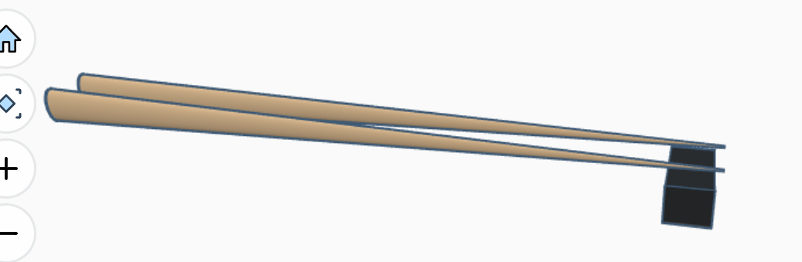
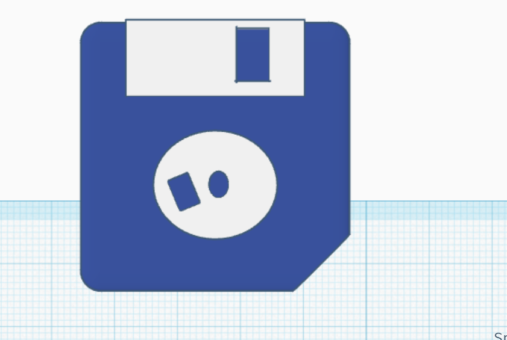
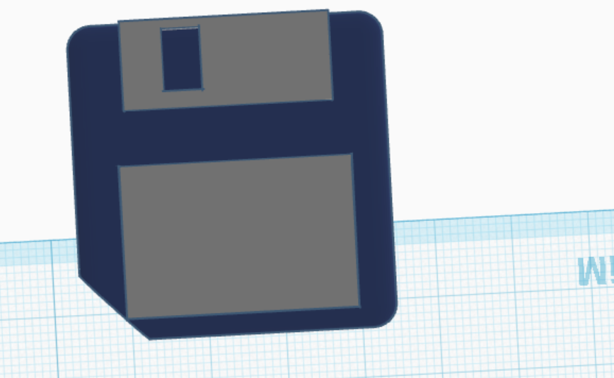
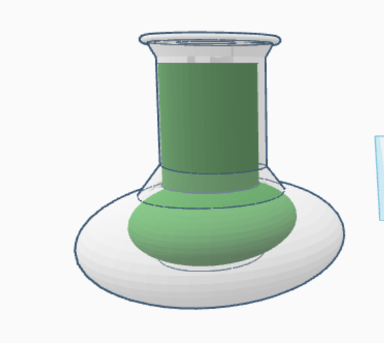
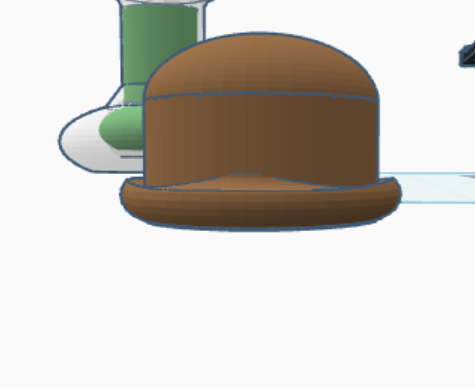
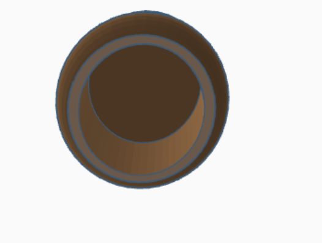
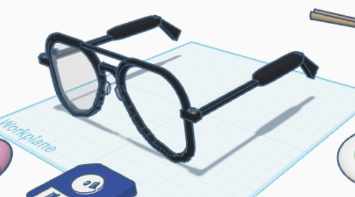
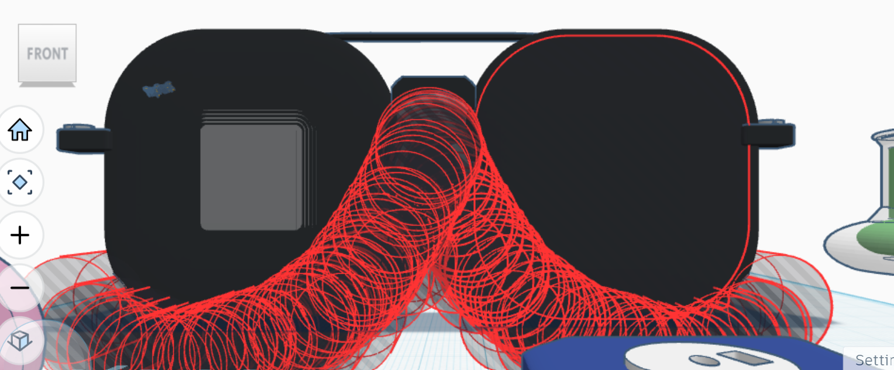

# Journal Number 7 - FREECAD!

 

In this journal entry, I had the opportunity to work with FreeCAD. This is my first introduction into 3D design, unless you are counting TinkerCad. The tutorial Image was fairly easy to make with it taking me about 40 minutes to complete with some small hiccups made along the way.

 

 

| Tutorial Image |
|:----------:|
|  |

 

THIS PART BROKE ME
Both mentally and spiritually.
I had sent myself my file so I could work on the already padded out claw arm thingy on my home computer on a bigger screen and even a wireless mouse! However, the issue arises when I tried for hours fully constraining the wire hole part box, attempting to pad it, then slamming my head against the surrounding walls for immediate relief. In all seriousness I started from scratch boxes on my home computer for about 3-4 hours. I then switched to my laptop and it took me about 3 minutes to finish the shape... 

Without Further ado, I present to you my wire holder for my home desk.

| Desk Image | Wire Holder |
|:----------:|:--------------:|
|  |  |

 

Genuinely whether or not I attempt the third object depends how well I am able to complete my other coursework, because I cannot justify me spending anymore time on a fun but 2000s level class when I also actually need to graduate. Don't think I am lazy, I can show you my Youtube watch history if you do not believe me.

| Chopsticks | 
|:----------:|
|  |

 

| Floppy Disk Front | Floppy Disk Back |
|:----------:|:--------------:|
|  |  |

 

| Flask |
|:----------:|
|  |

 

| Bowler Hat Top | Bowler Hat Bottom |
|:----------:|:--------------:|
|  |  |

 

### Prepare to be Amazed...

| Aviator Sunglasses | Aviator Sunglasses design |
|:----------:|:--------------:|
|  |  |

# THANK YOU