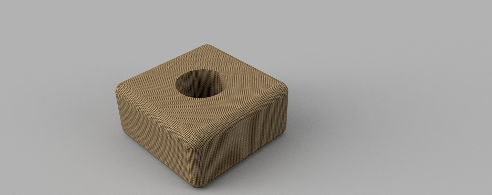
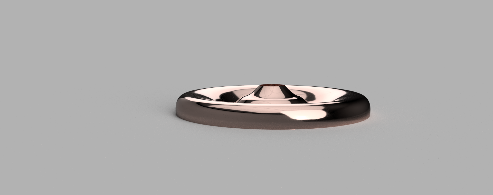
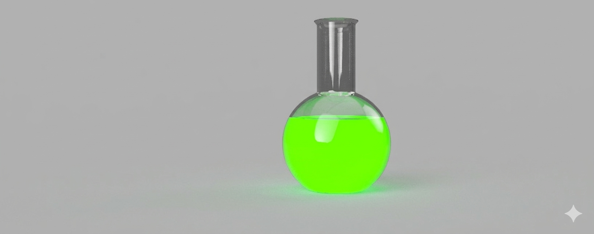
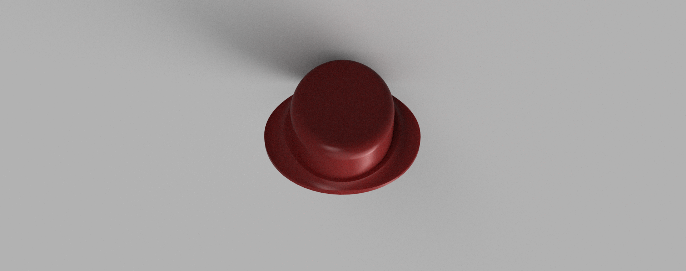

# Journal Number 8 - Fusion360

 

The first image we made in class. Fusion360 is a great 3D modeling software definetly my favorite out of the three we have used so far. This simple box was super easy to make 10/10 would recommend for beginners and thats about all I have to say without droning on for too long.

 

| 1st Image - Box |
|:----------:|
|  |

 

The second image we also made in class and that was a lampshade. Super simple, not fun or even engaging. Thats about it a poorly made lamp shade below!

| Second Image - Lampshade | 
|:----------:|
|  | 

 

The third object was mostly completed in class and mostly finished but in reality I was the one that did not finish it all. The issue arose when I had the flask rendered and a 10mm internal offset in the sketch and deleted all the extra bits of the flask and revolved it properly. Long story short I was not able to get the liquid into the flask. BUT NO WORRIES, as innovation is the name of the class and yes I got both lazy and "innovative". After a while of trying to troubleshoot the issue, I ended up prompting AI! HAHA! After a simple image upload I typed the following prompt "I used fusion 360 and rendered an image of the flask, inside the flask add a neon green liquid" and then it did. SO INNOVATIVE! I am not very proud of this one but at least the Gemini Logo in the bottom right corner is visible and you can just give me credit for whatever for the clear flask with flat bottom and NO LIQUID credit I am fine. 

| Third Object - Flask | Third Object - AI Flask LOL |
|:----------:|:--------------:|
|  |  |

Last Image is a bowler hat and I believe I outdid myself with this one. I was able to extrude a simple ellipse with a circle around it and then on the same plane make another ellipse (no extrusion just a line) and then used the pipe tool (similar to the TinkerCAD method) but I could not make the Taurus method work for the hat because it was way too thick. While the bottom is not pretty it is usable and can be worn by someone (not to scale) but with a 50mm sphere cut out.

| Final Object - Bowler Hat | Final Object - Bowler hat Underneath |
|:----------:|:--------------:|
|  |  |

Thank you for coming I hope you enjoyed!

# THANK YOU