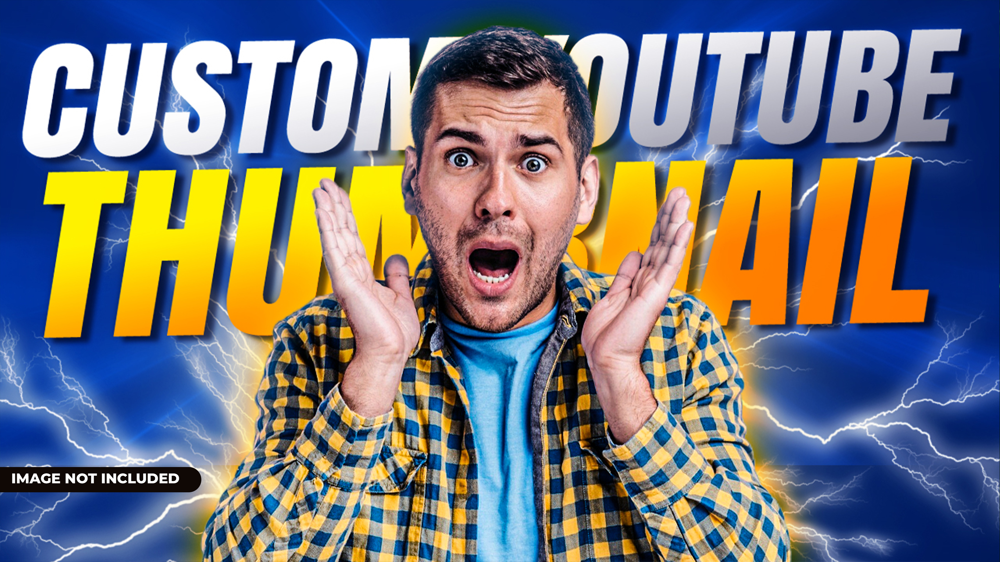
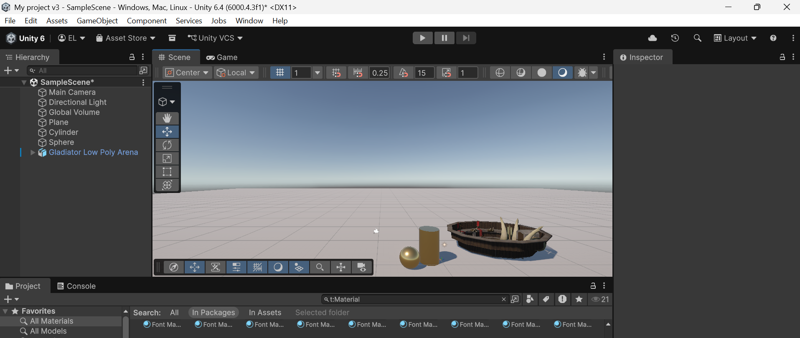
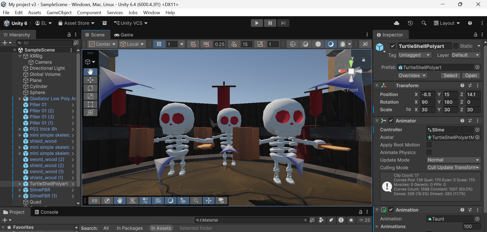
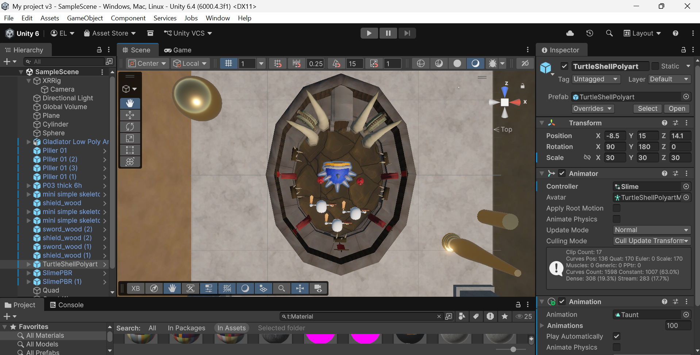
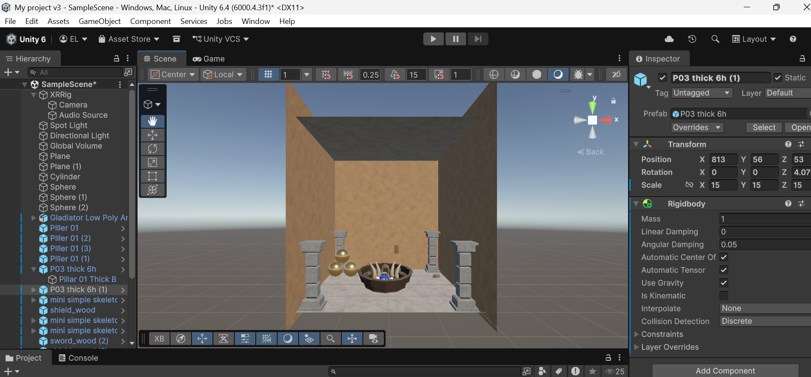
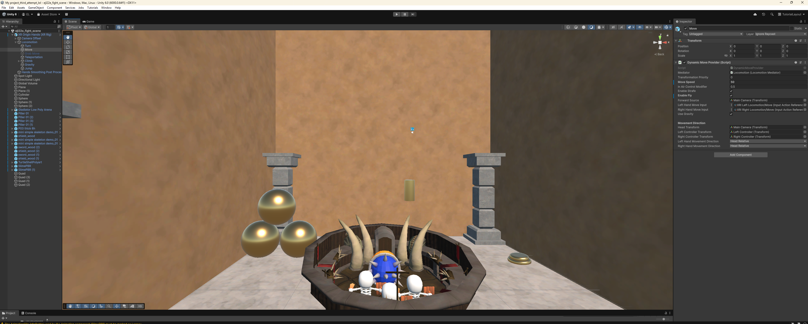

# FINAL JOURNAL PROJECT: VR WORLD
# COLLESEUM & FIGHTERS

|[CLICK ON IMAGE OR HERE](https://youtube.com/shorts/KNdkETHF-54?feature=share)|
|:----------:|
| |

 

FUN FUN FUN is how I would describe this project. Unity is great and I genuinely think I have a semi-solid introductory understanding of unity, 3D modelling and development. Unity is basically a GUI for coding and even though its built in C++ and compiled in C# it reminds me a lot of python with extensive libraries and really 'plug and play' assets that speed up development by hundreds of times.

I actually enjoy being thrown into the deep end and having to read documentation and watch tutorials and fail in my own way as it is a very effective way to learn. Unity makes sense once you understand the basics like mesh colliders, framing, physics, landscape, scale, and other core concepts related to animation, XR but in reality it is just another programming language with a lot of built in libraries and features that you have to be cognizant of to use.

The below list is exactly and literally what I went through. All in all the entire project start to finish, with videos, troubleshooting, and submission refinement took about 10 hours, which is better than I anticipated. The overall theme is to crazy scale, rigidbody physics on some objects showcasing my *talent*, a voice announcing the fight, and lastly some characters with limited fighting animations. Thank you and I hope you enjoy the video, my photos, and my list of steps I took to complete.

 

<b>steps I took to complete the project: </b>

1. watched 100 second tutorial on unity on how to add objects, physics and rigid body
2. import assets that i think can be cool
3. broken assets EVERYTHING IS PINK
4. fix assets by converting rendering and shaders from URP to builtin
5. create mental plan of what I want the world to look like through future insight and past experiences of PINK objects
6. build VR world without class specifications because I missed the last class and everyone i texted said there is so much to explain and just see lucas in the Hub and call it a day
7. get super sick and cannot leave bed for 3 days troubleshooting issues with VR experience on overheating and borderline molten laptop
8. go to hub with semi finished project to see where my VR world holds up
9. CRY? GIVEUP? DOOMSCROLL?
10. Using and converting low poly arena, pillars, skeletons so they are not pink and scaling to desired fit
11. After some tinkering I wanted the vibe to be a like gods watching smaller beings fight in a huge arena surrounded by an even larger world (not yet created)
12. cuphead announcer voice converted youtube video to mp3 and imported into unity project
13. spotlight on top of arena
14. FIGURE OUT XR ORIGIN...
15. get rest feel better
16. go to hub to test out project
17. Get help from Jason at the Hub setting uo my XR origin because I was not moving
18. Give up after 1.5 hours of trying our solution was... copy/paste the XR origin from sample scene and it worked flawlessly
19. Classmate arrived to take video of my project
20. DONE

 #### Assets and Audio's Used - 

- [low poly arena](https://assetstore.unity.com/packages/3d/environments/fantasy/low-poly-gladiators-arena-167116)
- [skeletons](https://assetstore.unity.com/packages/3d/characters/humanoids/fantasy/mini-simple-characters-skeleton-free-demo-262897)
- [dual slime and turtle monsters](https://assetstore.unity.com/packages/3d/characters/creatures/rpg-monster-duo-pbr-polyart-157762)
- [pillars](https://assetstore.unity.com/packages/3d/environments/simple-modular-pillars-255707)
- [cuphead announcer voice](https://www.youtube.com/watch?v=oDuAV5u_PTk)

### Screenshots of my *GENIUS* VR WORLD progress photos -

|Development Image 1 |
|:----------:|
|  |

|Development Image 2 |
|:----------:|
|  |

|Development Image 3 |
|:----------:|
|  |

|Development Image 4 |
|:----------:|
|  |

|FINAL IMAGE |
|:----------:|
|  |

 

[Youtube Video Link](https://youtube.com/shorts/KNdkETHF-54?feature=share)

# THANK YOU