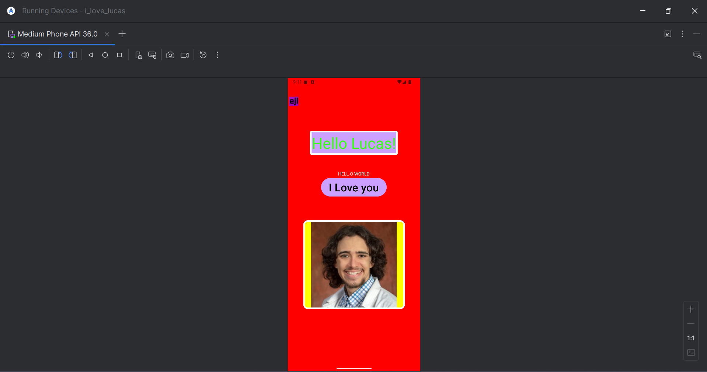

# Journal Number 2

*‘My name is Ozymandias, king of kings:
Look on my works, ye Mighty, and despair!’
Nothing beside remains. Round the decay
Of that colossal wreck, boundless and bare
The lone and level sands stretch far away.” *
 
- Percy Bysshe Shelley
 

In this journal entry, I chose to not use appinventor by MIT/Google and instead chose the also *well-loved* Android Studio Code also developed by Google... I made a simple app that displays an image, some text, and a button that when clicked changes the text displayed on the button. I wanted to add audio on button click,as well as, having the text change back and forth between the two states, but got tired so instead I settled for the simple one click text change.
 

### Scrolling Video of Android Studio Emulated App

 

  

# THANK YOU