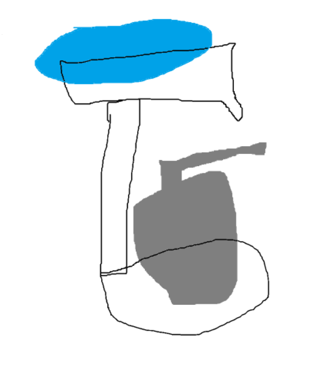

# Journal Number 9 - Fabricating a function

 

Simple explanation - I am making a two tiered soap holder capable of holding and draining solid hand soap (more fun, and better for the environment), and also a base plate for my liquid soap holder. Problem begins with my cork soap holder, which served as my solid soap holder, fell apart after years of use. I think the plastic being pourous will help with evaporation and does not serve any health risk that is any better or worse than my previous cork soap holder, which was, a bacteria breeding ground. Some issues of top heavy weight will be offset with my solid soap holder, and seepage can be fixed with proper infill or layer thickness.

### Video & Initial SketchBelow -

 

| Initial Sketch |
|:----------:|
|  |

 

I am thinking of ways to theme the soap holder. My initial thoughts are to make leaves and the solid soap holder will be a droopy leaf and the base a flower, but I am unsure how complex that will be in practice!

Thank you for coming I hope you enjoyed my novel idea!

# THANK YOU