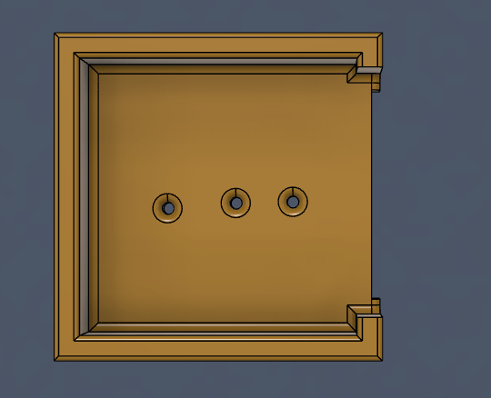
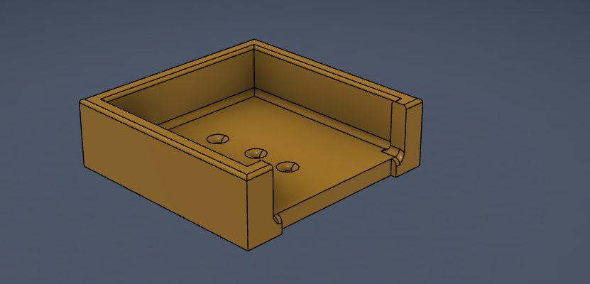
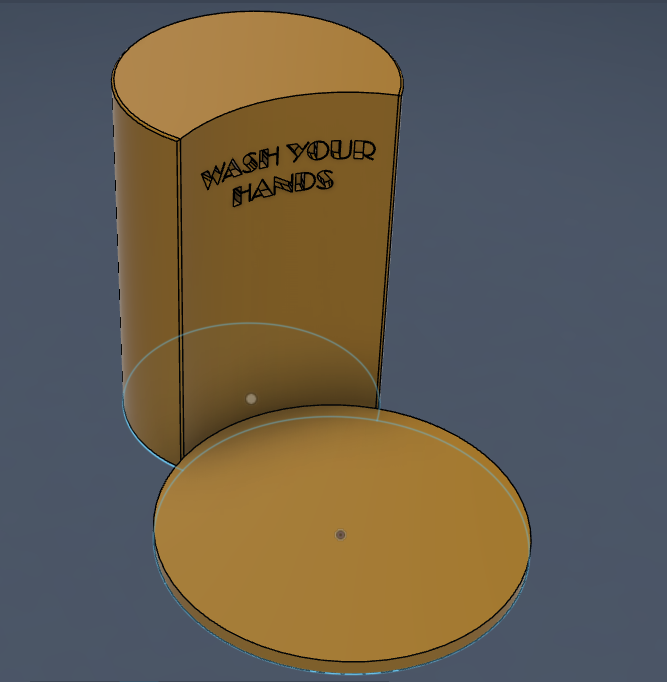

# Journal Fabricating for a Function Part 2 (Almost Done!)

 

For the function of being a two tiered soap holder, one dedicated to liquid soap and the other for solid bars of soap, I have decided to also make the soap holder in two separate prints. This is because of the demonstration in class, showcasing the amount of support and increased time and PLA used to make supports but also the increased risk of failure when printing with supports. The following is the design: A print for the liquid soap, and a print for the solid soap. How cunning!

My plan is as follows: The solid soap holder has channels for the water to drain into, a bezel to help the water flow to the sides and out the front, and lastly 3 small holdes in the center for extra drainage. While the middle holes will allow the water to fall willy nilly, I don't see any crazy issues arising. For the liquid soap holder, I have measured the required dimensions and have even added a fun transcribed message of "WASH YOUR HANDS" to encourage use. PLEASE LUCAS TELL ME IF THE EMBOSSED TEXT IS BAD FOR PRINTS I HAVE NO CLUE AND AM TOO LAZY TO SEARCH ONLINE. The two pieces will be super glued and as I do not own sandpaper I intend to roughen the contacts via scraping it on the cement outside my apartment. 

As I write this, the AI embedded in my editor suggested to add a hole in the stem so I can hang it from the wall, which actually seems like a fun addition that I will not pursue.

The measurements are as follows: Solid Soap Basin Bottom is 160mm diameter x 10mm height, Solid Soap Stem has 60mm radius and a height of 177mm (around 7 inches), the Solid soap holder is around 5inch by 5 inch box with a 10mm wall thickness. I measured both my liquid soap and my Zesty solid soap and these measurements have a wiggle room of about 50mm in total.

### Screenshots Below -

| Solid Soap Basin | Solid Soap Basin Side View |
|:----------:|:----------:|
|  | |

 

| Liquid Soap Stem & Base |
|:----------:|
|  |

 

# THANK YOU