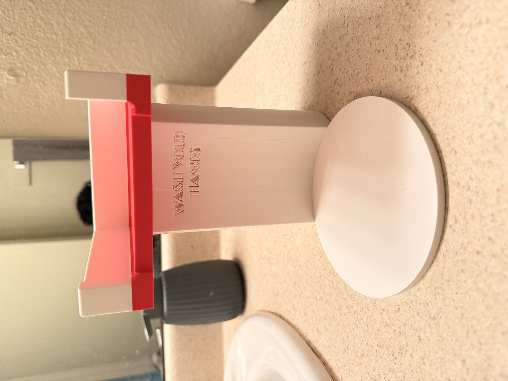
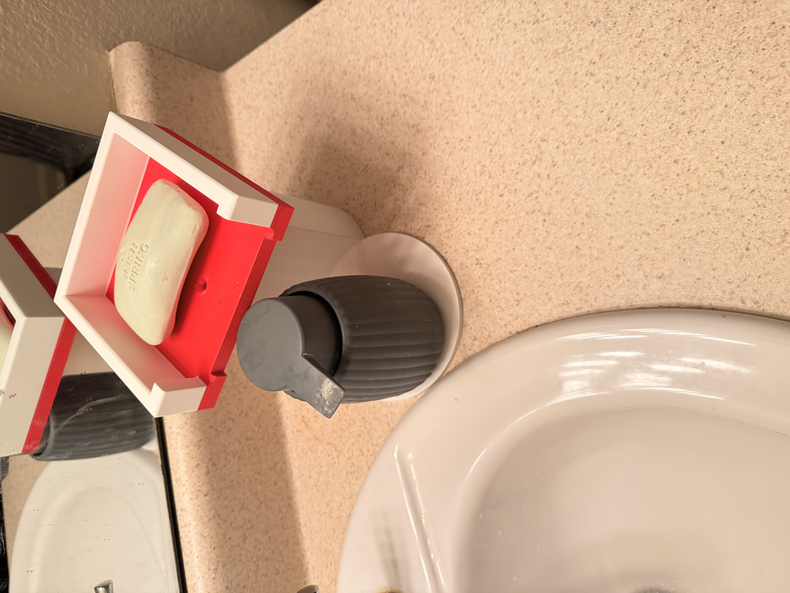

# Journal Fabricating for a Function Part 3 AKA ... done done done done done with...
# DOUBLE DECKER SOAP HOLDER AKA PEAK INNOVATION

 

Before I get into the project, I have a view things I would like to say and then I will get off of my soap box. HAHA!

First, antibacterial soap is a lie, a scam, and is not only a waste of money but also a very societally harmful product. Post COVID, the world is really wierd... some people are overly scared of bacteria, others more aware of the importance of healthcare, epidimeology, and public health, and then there are the others... The others that do not believe in *COVID?!?!?!?!?!*. 

However my gripe is not with *those* people right now, currently its focused on the scam that is antibacterial soap and overall liquid soaps. Liquid soap can be anything, detergant, dish, body, face or other, but the point is that liquid soap is not only more expensive than solid soap but also has a much higher carbon footprint. The packaging, the transportation, the production, and the waste of liquid soap is just not worth it. 

Further, antibacterial soap is terrible for your skin and causes overdrying, irritation, and is the direct cause of "superbugs" or antibiotic resistant bacteria. The chemicals in antibacterial soap are not only harmful to the environment but also to your skin and overall health. I am NOT LYING, antibacerial soap is not recommended by the CDC for use in home, business, or office settings. The only time it is recommended is in healthcare settings. *AND* antibacterial soap is not more effective than regular soap in killing bacteria. In fact, regular soap is just as effective in removing dirt, grime, and bacteria from your skin.

This brings me to my project, the double decker soap holder. It simply is a place that holds my liquid soap and solid soap, giving my guests a brutally obvious choice. I did not run into any issues other than the longer print time in which I went to lab admins and they were able to grant me unlimited print time. Also, I had eyeballed some of my estimates and was on the liberal side which made the stem portion of the print too large for the printer, so I had to scale it down a bit and not only did both of my prints work and fit, but also were successful first try! 

I am happy with the outcome and I hope that it will be a conversation starter for my guests and maybe even encourage them to switch to solid soap after they ask me about my super wierd soap holder and I will have to go on this same exact rant all over again. 

[LINK TO MINNESOTA Department of Health - "Antibacterial soap vs. Plain soap: Which is better?"](https://www.health.state.mn.us/people/handhygiene/how/bestsoap.html)

 

[LINK TO CDC Article - "Antibacterial Household Products: Cause for Concern"](https://wwwnc.cdc.gov/eid/article/7/7/01-7705_article)

### Screenshots of my *GENIUS* project below -

| Soap Holder No Soap | Soap Holder With Soap |
|:----------:|:----------:|
|  | |

 

# THANK YOU