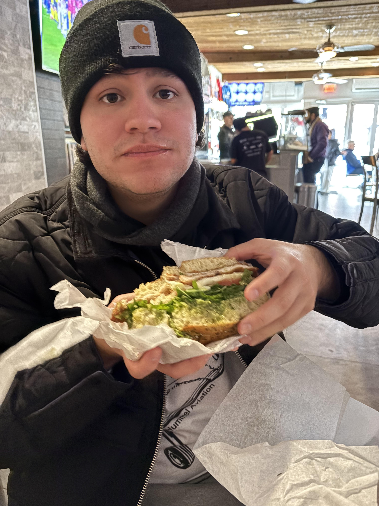

# Journal Number 1

*From this point on, I've decided to write down everything I see and experience which might possibly have a bearing upon my nocturnal mission. This journal will be a complete record of my deeds which I can refer back to and a voucher to show [Lucas Von Hollen] when they come looking for me on [the Due Date].* 

Pulled from my LinkedIn - 
"Elias Latimer is a senior at Florida State University pursuing dual bachelor’s degrees in information technology and psychology. He is passionate about systems analysis, cybersecurity, and the role of effective communication in building and maintaining reliable, user-centered technology.

With a strong interest in integrating psychological insight into technical problem-solving, Elias aims to bridge human behavior and system design to improve both user experience and operational security. He is currently gaining hands-on experience as a Salesforce DevOps Intern with the FSU IT Department, where he supports system reliability, workflow optimization, and AI integration.
 

Elias aspires to work in a cutting-edge technology and cybersecurity role that creates meaningful, community-focused impact."

Now that the formalities are out of the way, the real "me" begins.  
Hi, I am THE Elias Latimer, I love learning new things, reading literature (boring books by *boring* people like Kurt Vonnegut, Dostoyevsky, and Albert Camus), and generally being outside moving around whether that be in nature or playing intermural flag football with my friends. I am conflicted between choosing industry or academia because both seem equalling appealling and unfulfilling.

 Below is a photo with, what I believe to be, the best sandwhich ever from my December 2025 trip to Boston/Rhode Island with my partner.

  

# THANK YOU