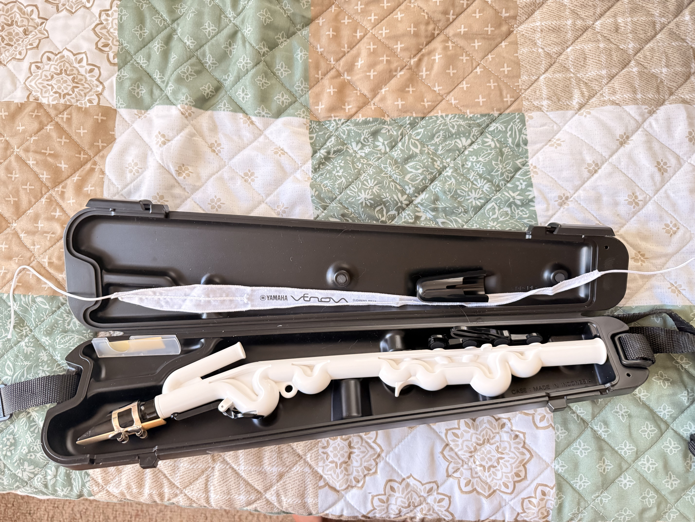
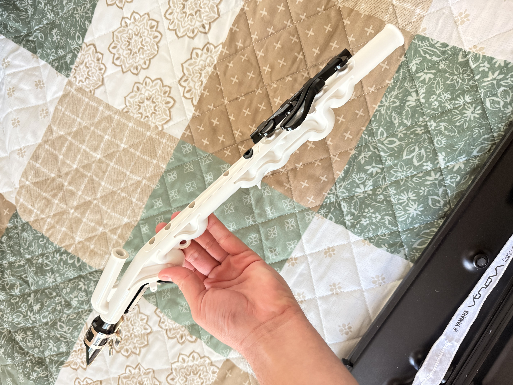

# Journal Number ??? - Final Sound Assignment

 

I have completed the final sound assignment and I am truely delighted to share with you! Please let me know any feedback you have for me. I understand I need a LOT of work, consistent breathing, embouchure, spit regulation, and overall talent needs to be refined, but without further ado, enjoy!

### WAV file and Images of my Venova Below! 

[LINK TO WAV](../journal_original_sound_concert/ids2141_original_sound.wav "Link to file")

 

| Venova In Case | Venova Out of Case |
|:----------:|:----------:|
|  | |

 

As you could hopefully tell, I am not a professional or novice or even beginner musician, but am something a tad bit worse.

# THANK YOU