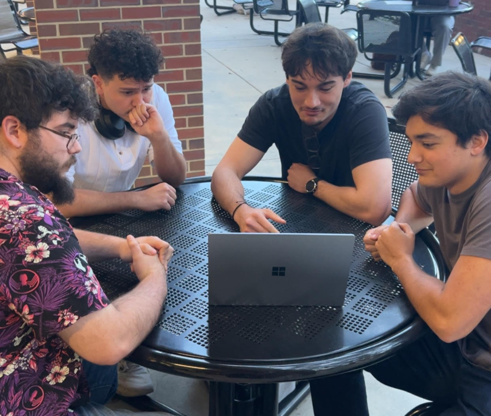

# Journal Number 3 - Teamwork

 

| OG Thinker | Modern Thinker |
|:----------:|:--------------:|
|  |  |

 

<a href= "https://en.wikipedia.org/wiki/The_Thinker"> The Thinker </a>
 

In this journal entry, I will discuss what we were able to get done as a group. Which is surprisingly very little. As a group we chose to use Android studio code, which is a mistake because it places all the hands on development of an app on myself (me being the most and only familiar with the program). However, I would much rather do all the development in Android Studio then have to touch whatever everyone else is having to use *MIT GARBO CREATOR* . I was able to create a very basic three faced android app that has buttons in to navigate between pages, and the first page displaying the time. Because of my sole involvement in app-development I am taking a very hands off approach in brainstorming and idea creation, so as to make my other members critically think. We are trying to make an app that has some sort of time based component as the logic seems straightforward but are having issues in making a time based app that is both novel and fun. The member coined as "Android Man", shows remorse for me being the sole engine to the machine while the rest of the group get to be passengers. No biggie, as I will let them steer the ship directly into the iceberg. Full steam ahead!

 

# THANK YOU