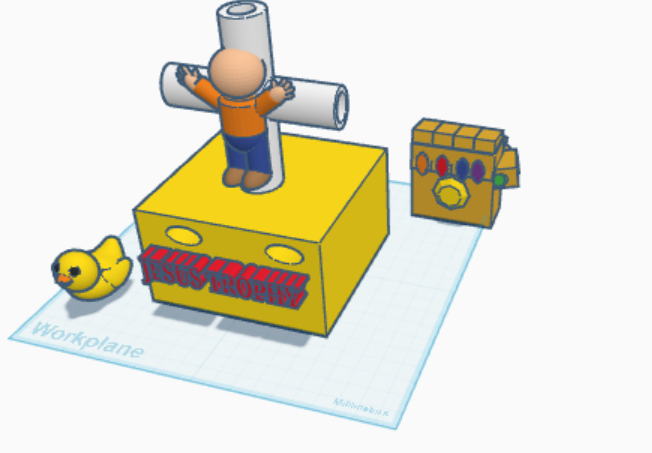
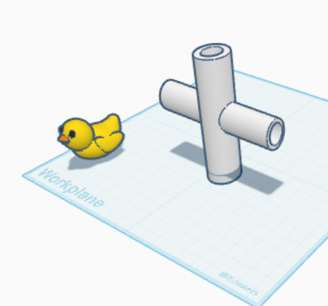
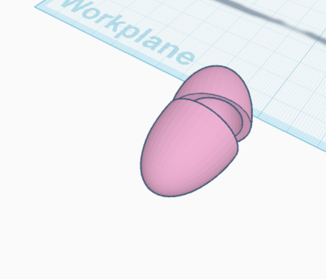

# Journal Number 6 - TINKOCAD!

 

 

<a href= "https://en.wikipedia.org/wiki/The_Thinker"> The Thinker </a>
 

In this journal entry, I had the opportunity to put to use the skills of 3D modeling. Utilizing insinctual skills of spacial awareness and practical design, both of which have been honed through millenia of evolution. I present the following images below as evidence of my intellectual capability. PVC Crossjoint, Egg, Floppy Disk, Chopsticks, Erlenmeyer Flask, Bowler hat, and my magnum opus... Aviator sunglasses.

 

| PVC Crossjoint 1 | PVC Image 2 |
|:----------:|:--------------:|
|  |  |

 

| Pink Egg |
|:----------:|
|  |

 

| Chopsticks | 
|:----------:|
|  |

 

| Floppy Disk Front | Floppy Disk Back |
|:----------:|:--------------:|
|  |  |

 

| Flask |
|:----------:|
|  |

 

| Bowler Hat Top | Bowler Hat Bottom |
|:----------:|:--------------:|
|  |  |

 

### Prepare to be Amazed...

| Aviator Sunglasses | Aviator Sunglasses design |
|:----------:|:--------------:|
|  |  |

# THANK YOU